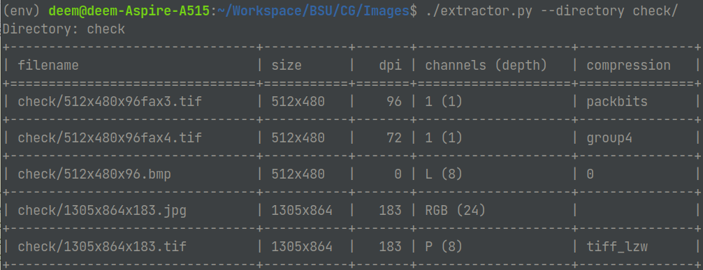

# Компьютерная графика. Лабораторная работа №2
Солодуха Дмитрий, 13 группа
## Задание
Написать приложение/веб-приложение, считывающее из графического файла/файлов основную информацию об изображении:
- имя файла;
- размер изображения;
- разрешение;
- глубина цвета;
- сжатие.

## Реализация
Реализация представлена в виде скрипта на языке `Python` с использованием библиотеки [`PIL`](https://pillow.readthedocs.io/en/stable/). Основная работа в скрипте выполняется с помощью библиотеки `PIL`, которая в свою очередь считывает нужные нам метаданные из специальных частей в файле изображений: `Exif`, `XMP`, `IPTC`. 

Пример работы можно видеть ниже:


Пользователь имеет возможность передать папку используя аргумент `--directory [DIR]`

## Скачать и запустить
Если установлен интерпретатор `Python`, то можно просто скормить скрипт ему:
```cmd
git clone https://github.com/sMeDDveD/ComputerGraphicsLab2.git
cd ComputerGraphicsLab2
python -m venv env && env\Scripts\activate
pip install -r requirements.txt
python extractor.py --directory directory
```

Если интерпретатора нет, то нужно скачать статически скомпилрованный `exe`-файл [отсюда](https://github.com/sMeDDveD/ComputerGraphicsLab2/releases/download/1.0/extractor.exe).
Тогда запустить его можно из консоли, передав нужную папку:
```cmd
extractor.exe -d directory
```
Или как обычный исполняемый файл, но тогда он будет искать изображения в директории, из которой был запущен.
